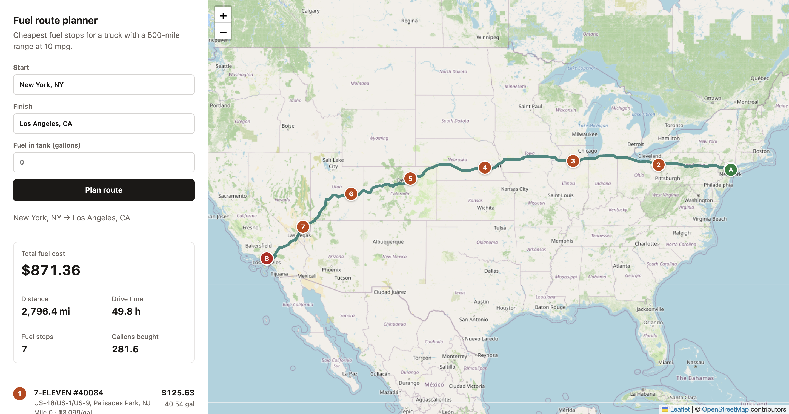
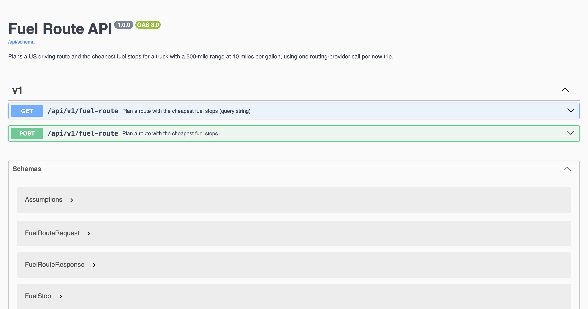
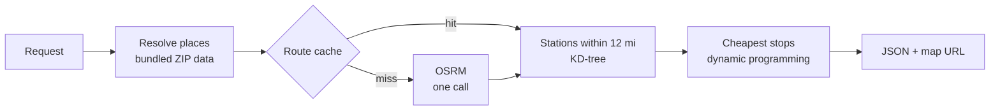

# Fuel Route API

[](https://github.com/iamsaad640/spotter-fuel-route-api/actions/workflows/ci.yml)


Plans a driving route between two places in the US and chooses where a truck should buy fuel so the trip costs as little as possible. The truck has a 500-mile range and does 10 miles per gallon; prices come from the supplied OPIS file. Each new trip makes one call to the routing provider.



## Quick start

```bash
docker compose up --build
```

| URL | What |
|---|---|
| http://localhost:8000/api/docs | Swagger UI |
| http://localhost:8000/map?start=New%20York,%20NY&finish=Los%20Angeles,%20CA | Map of a planned trip |
| http://localhost:8000/healthz | Health check |

Without Docker, with [uv](https://docs.astral.sh/uv/) installed: `make install && make run`. `requirements.txt` is exported from `uv.lock` for plain pip setups.

The Postman collection in [`postman/`](postman/spotter-fuel-route.postman_collection.json) covers every input style and error case, and draws each planned route in Postman's **Visualize** tab.

## API

`POST /api/v1/fuel-route`, or `GET` with the same fields as query parameters.

```bash
curl -s http://localhost:8000/api/v1/fuel-route \
  -H 'Content-Type: application/json' \
  -d '{"start": "New York, NY", "finish": "Los Angeles, CA"}'
```

| Field | Type | |
|---|---|---|
| `start`, `finish` | string or object | `"City, ST"`, a ZIP code, `"lat,lon"`, or `{"latitude": …, "longitude": …}` in the contiguous US |
| `starting_fuel_gallons` | number, 0–50 | Fuel already in the tank. Default `0`, so the total covers every gallon the trip burns |

<details>
<summary>Response (shortened)</summary>

```json
{
  "start": { "label": "New York, NY", "latitude": 40.7571, "longitude": -73.9778 },
  "finish": { "label": "Los Angeles, CA", "latitude": 34.0522, "longitude": -118.2494 },
  "distance_miles": 2796.4,
  "drive_time_hours": 49.8,
  "total_fuel_cost_usd": "871.36",
  "gallons_purchased": "281.47",
  "fuel_stops": [
    {
      "opis_id": 62790,
      "name": "7-ELEVEN #40084",
      "address": "US-46/US-1/US-9",
      "city": "Palisades Park",
      "state": "NJ",
      "latitude": 40.8462,
      "longitude": -73.9954,
      "location_source": "city_centroid",
      "route_mile": 0.0,
      "miles_off_route": 0.0,
      "price_per_gallon_usd": "3.099",
      "gallons": "40.54",
      "cost_usd": "125.63",
      "fuel_on_arrival_gallons": 0.0
    },
    {
      "opis_id": 72782,
      "name": "SHEETZ #791",
      "address": "I-76, Exit 57",
      "city": "North Jackson",
      "state": "OH",
      "latitude": 41.1072429,
      "longitude": -80.8813249,
      "location_source": "osm_exit",
      "route_mile": 403.4,
      "miles_off_route": 2.0,
      "price_per_gallon_usd": "3.06566666",
      "gallons": "50.00",
      "cost_usd": "153.28",
      "fuel_on_arrival_gallons": 0.0
    }
  ],
  "map_url": "http://localhost:8000/map?start=40.7571%2C-73.9778&finish=34.0522%2C-118.2494",
  "route": { "type": "LineString", "coordinates": [[-73.97777, 40.75714], [-73.97651, 40.7566]] },
  "assumptions": {
    "tank_gallons": 50.0,
    "miles_per_gallon": 10.0,
    "range_miles": 500.0,
    "starting_fuel_gallons": 0.0,
    "stop_penalty_usd": 10.0,
    "station_corridor_miles": 12.0,
    "station_locations": "OpenStreetMap exit node where the address names an exit, otherwise the city centroid; the CSV has no coordinates"
  },
  "meta": { "request_id": "5f0c2a9d8e7b4c1a9f3e6d2b7a1c8e4f", "routing_calls": 1, "elapsed_ms": 2570 }
}
```

`fuel_stops` shows the first two of seven; `route` is cut to two of 2,583 points.

</details>

The same contract, with examples for each input style, is browsable at `/api/docs`:



Errors share one shape, `{"error": {"code", "message", "details"}, "request_id"}`:

| Status | Code | When |
|---|---|---|
| 400 | `invalid_request` | Unknown place (with close-match suggestions), outside the contiguous US, bad field |
| 422 | `route_not_found`, `fuel_plan_infeasible` | No driving route, or stations too far apart for a 500-mile range |
| 429 | `throttled` | More than 60 requests a minute from one client |
| 502 | `routing_provider_unavailable` | OSRM failed or timed out |

## How it works



1. **Places** resolve offline from the bundled ZIP dataset: city and state, ZIP, or coordinates. Typos get suggestions instead of a second API call.
2. **Route.** One OSRM request returns the full road geometry. It is cached (Redis under Compose), so replanning the same trip or opening its map makes no further calls.
3. **Candidates.** Stations within 12 miles of the route are found with a KD-tree over unit-sphere vectors, then placed by the mile at which the truck passes them.
4. **Stops.** A dynamic program over (station, fuel left when leaving it) in 0.1-gallon steps picks the stops; detours off and back onto the route count as fuel burned. Purchases for the chosen stops are then computed exactly: buy just enough to reach the next cheaper stop, otherwise fill up.
5. **Response.** The route is simplified to about 50 m for display, and the map page draws it with the stops.

## Decisions

- **The truck starts empty** and fills up at the cheapest station within 25 miles of the start, so the total is the cost of the whole trip. Pass `starting_fuel_gallons` for a truck that is already fuelled.
- **Each stop costs $10 in the objective** (`FUEL_STOP_PENALTY_USD`). The cheapest possible plan often adds 2-gallon top-ups to save cents; the penalty roughly halves the number of stops for 1–3% more fuel spend. Set it to `0` for the strictly cheapest plan.

  | Route | Stops, penalty 0 | Stops, penalty $10 | Extra fuel cost |
  |---|---:|---:|---:|
  | Boston → San Francisco | 18 | 8 | $13.32 (1.4%) |
  | New York → Los Angeles | 16 | 7 | $13.21 (1.5%) |
  | Seattle → Miami | 16 | 8 | $9.35 (0.9%) |
  | Chicago → Houston | 6 | 3 | $9.91 (3.0%) |

- **Station positions.** The CSV has addresses but no coordinates. Most addresses name an interstate exit (`I-44, EXIT 283 & US-69`); 3,027 of those 3,242 are placed at the exit itself, 46% of all stations, a median 2.7 miles from their city centre. The rest stay at the city centre. Positions come from `manage.py locate_stations`, a one-off job that matches each address's exit number to OpenStreetMap exit nodes near the station's city and writes [`data/station-locations.csv`](data/station-locations.csv). The API only reads that file. Each fuel stop reports its `location_source`.
- **Duplicate station rows** in the CSV have no timestamps, so the highest listed price is used. IDs listed at two different addresses are dropped.
- **Dynamic programming instead of a MILP.** The first version used a HiGHS MILP. It took 0.5–4 s on cross-country routes and depended on a solver time limit. The DP matches its totals within 0.03% on six recorded routes and runs in 3–140 ms.
- **No database.** The service is stateless; the station index is built from the CSV at startup and shared by gunicorn workers.

## Performance

`make bench` replays a recorded New York → Los Angeles OSRM response (2,794 miles, 34,634 vertices) through the real parser:

| Stage | Time |
|---|---:|
| Station index, once at startup | 609 ms |
| Corridor search (484 candidates) | 15 ms |
| Full plan, warm | 183 ms |

Against the live OSRM demo server, a new cross-country trip takes about 2 s end to end, most of it the routing call; a cached trip takes about 0.2 s.

## Development

| Command | |
|---|---|
| `make install` | Install from `uv.lock` |
| `make run` | Development server on :8000 |
| `make check` | ruff, mypy, pytest with coverage (the CI gate) |
| `make bench` | Stage timings on the recorded route |
| `make up` / `make down` | Compose stack with Redis |

CI also validates the OpenAPI schema, runs `manage.py check --deploy` with production settings, and boots the container for a smoke test. Configuration is environment-driven; see [`.env.example`](.env.example).

```
routefuel/
  places.py      offline place lookup
  routing.py     OSRM client
  corridor.py    stations near the route
  optimizer.py   stop selection and purchases
  service.py     planner and route cache
  views.py       API, map page, health check
  exits.py       exit matching for locate_stations
```

## Limitations

- Station positions not tied to an exit are city centres, and detours are straight-line estimates, not driven.
- The OSRM demo server is for light use. `ROUTING_BASE_URL` points the service at any OSRM-compatible deployment.
- Prices are a static snapshot.

## Data

Fuel prices from the supplied OPIS file. Routing by the [OSRM](https://project-osrm.org/) demo server. ZIP centroids from the `zipcodes` package ([GeoNames](https://www.geonames.org/), CC BY 4.0). Exit locations and map tiles © [OpenStreetMap](https://www.openstreetmap.org/copyright) contributors, ODbL.
